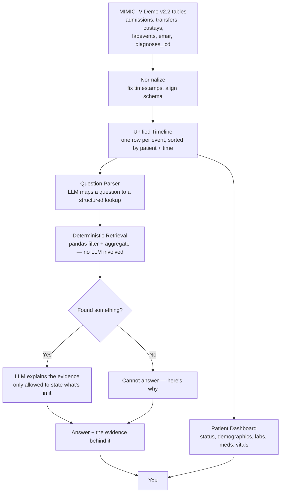
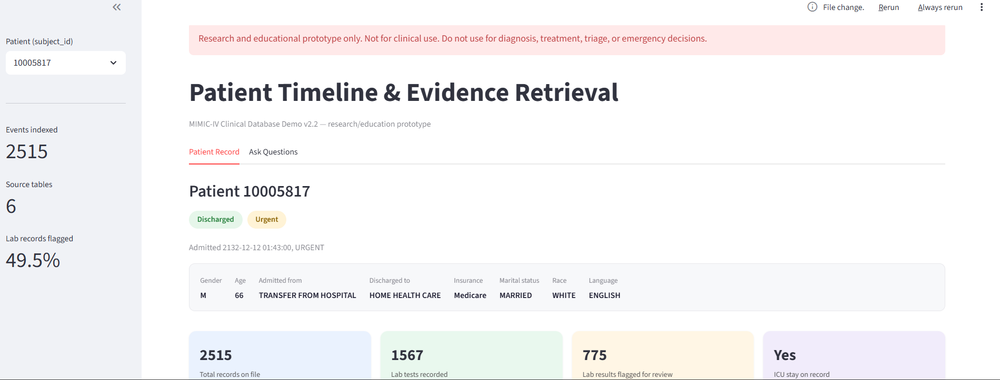
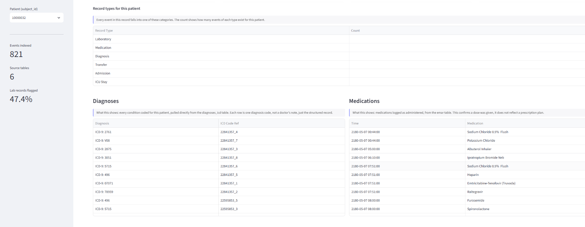
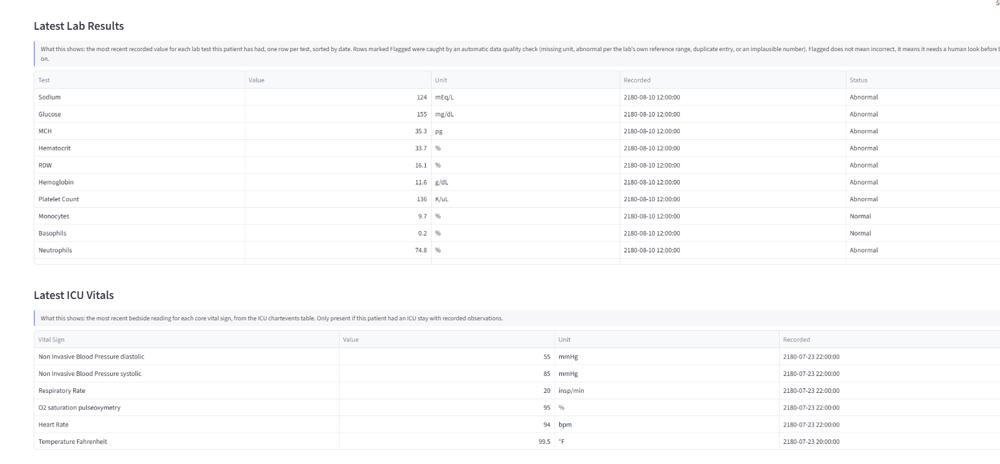
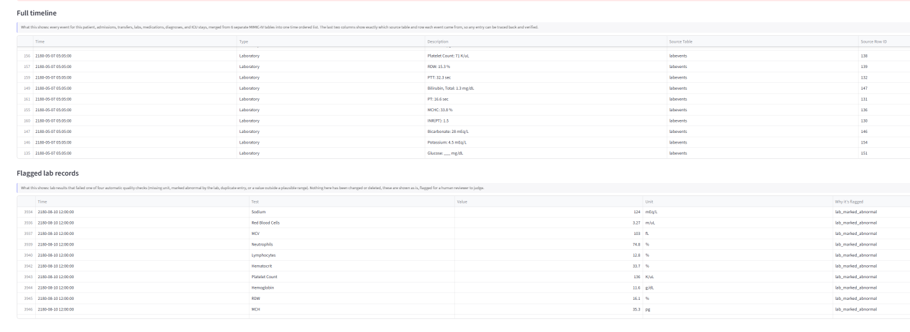
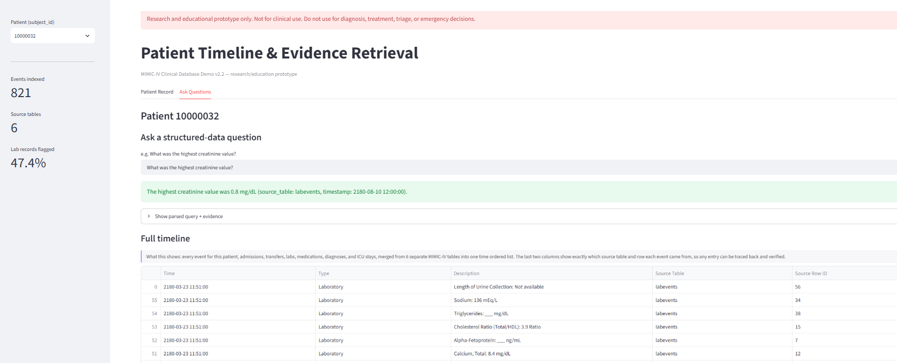
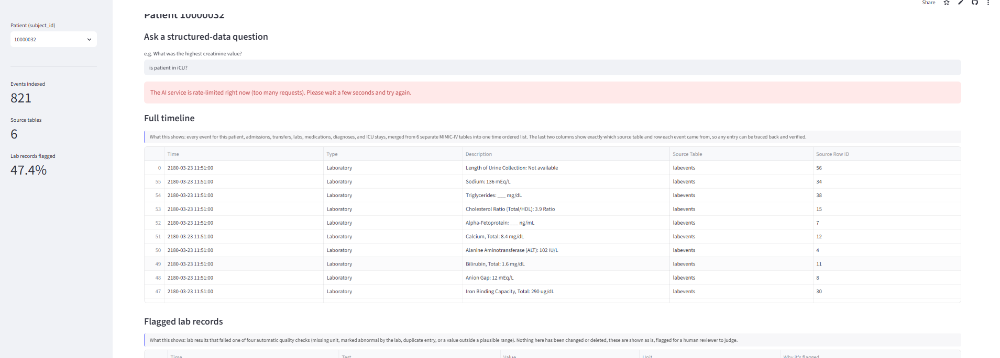

# AI for Smarter Patient Care

*A research and educational prototype. Not for clinical use. Please don't use this for diagnosis, treatment, triage, or emergency decisions — it isn't built or tested for that.*

## Overview

Hospital data is scattered across disconnected tables never designed to be read together. We assemble them into a single, chronological patient timeline and let you ask questions in plain English. The AI never guesses or hallucinates , it deterministically retrieves the real data first, then translates that evidence into a clear answer, or openly admits when it doesn't know.


## The Problem

If you've ever tried to actually read through a patient's hospital stay in MIMIC-IV, you know the pain: admissions in one table, transfers in another, labs in a third, medications somewhere else, diagnoses coded separately, ICU readings in yet another. To answer something as simple as "what was this patient's highest creatinine reading," you'd normally have to join several tables by hand, get the timestamps right, and hope you didn't accidentally pull in data from a completely different hospital visit. That last part matters more than it sounds  most patients in this dataset have been admitted more than once, so if you're not careful about which visit you're looking at, you can end up blending two unrelated hospitalizations into what looks like one continuous story.

## Our Solution

We wrote a pipeline that takes six MIMIC-IV tables (admissions, transfers, ICU stays, labs, medications, diagnoses) and normalizes them into one shared format  same columns, same time axis so they can all live in a single unified event table. From there, the app gives you two things: a dashboard view of a patient's record (who they are, what happened, what their labs and vitals look like), and a question box where you can ask something like "what medications was this patient on" and get back an answer that's grounded in the actual retrieved records, not a guess.

## What's Actually Built

We're only listing things we could verify by reading the code — not things that were planned, discussed, or half-started.

- **A unified timeline.** Six source tables get merged into one event feed per patient, and every single row keeps a pointer back to exactly which table and row it came from.
- **A patient dashboard.** Status badge, basic demographics, diagnoses, medications, latest labs, and ICU vitals, all on one screen.
- **Question answering that doesn't hallucinate by design.** A question first gets parsed into a structured lookup (which metric, which aggregation) using an enumerated list built straight from the real data — the model literally cannot pick a lab name that doesn't exist in the dataset. Then the actual answer — the max, the min, the latest value, the list of medications — comes from plain pandas code, not the language model. Only after that does the LLM get involved again, to turn the retrieved facts into a sentence, and it's explicitly told not to state anything that isn't in that evidence.
- **Real abstention.** If the data doesn't support a question, the app says so, with a specific reason, instead of making something up. We checked this fires correctly for unrecognized metrics, missing records, all-flagged-implausible records, and genuinely out-of-scope questions like "what's the weather."
- **Every answer comes with receipts.** Click to expand and you'll see the parsed query and the exact evidence rows the answer was built from.
- **Lab data quality flags.** Every lab result gets checked for a missing unit, being marked abnormal by the source system, being a duplicate, or being a physiologically implausible value. Flagged doesn't mean wrong — it means "a human should look at this before trusting it." Nothing gets silently corrected or deleted.
- **The disclaimer is actually on the screen.** Every page load shows the research-only warning, not buried in a README somewhere.

## How It Works



## The AI/QA Flow, in Plain Terms

You ask a question. First, the model figures out what kind of question it is — a lab value question, or an event lookup — and picks the closest match from a list of things that actually exist in the data. Then we go get the real answer using ordinary code: filter the data down to this patient, filter to the right metric or event type, and compute the max/min/latest or pull the matching records. If nothing turns up, we stop right there and tell you why, without ever calling the model again. If something does turn up, we hand the model just that evidence and ask it to explain it in a sentence — and the instructions are explicit that it can't add anything that isn't already there.

The point of building it this way is that the patient data is the source of truth, not the model. The model's job is translation and interpretation, not invention.

## Dataset

We're using the MIMIC-IV Clinical Database Demo v2.2, which is de-identified and publicly available through PhysioNet.

| | |
|---|---|
| Patients | 100 |
| Total events in the unified timeline | 149,673 |
| Laboratory events | 107,727 |
| Medication events | 35,835 |
| Diagnosis events | 4,506 |
| Transfer events | 1,190 |
| Admission events | 275 |
| ICU stay events | 140 |

Worth noting: 100 patients across 275 admissions means most people in this dataset were admitted more than once. That's relevant to a limitation described below.

## Technology Stack

Python and pandas for the data work, Streamlit for the app itself, and Groq's API (`llama-3.3-70b-versatile`) for the two narrow LLM jobs described above. `python-dotenv` handles local environment variables. No vector database, no embeddings, no RAG framework — retrieval here is straightforward filtering and aggregation over the unified table, which is simpler and, for this kind of structured lookup, more reliable than similarity search would be.

## Things You Can Actually Ask It

These work because they map onto the two query types the app supports:

- "What was the patient's highest recorded creatinine value?"
- "What was the latest hemoglobin result?"
- "What medications was the patient given?"
- "What diagnoses were recorded for this patient?"
- "Did this patient have an ICU stay?"

Open-ended questions, or anything that requires clinical judgment rather than a lookup, will come back as "cannot answer" — that's intentional, not a bug.

## Safety and Limitations 

This is a research prototype, not a clinical tool, and it says so on every screen. It hasn't been validated for accuracy or safety at any clinical standard, and 100 patients from one hospital is nowhere near enough data to generalize anything from.

The LLM is instructed not to state facts outside the retrieved evidence, and in the testing we did, it didn't — but a system prompt is an instruction, not a guarantee, and we haven't run a large-scale or adversarial test to see if it can be broken. Treat every AI answer as something to check against the evidence shown next to it, not as something to trust on its own.

The one gap we want to be upfront about: **the app doesn't currently separate a patient's different hospital admissions.** Since most patients here were admitted more than once, viewing "the patient's timeline" without picking a specific visit means you might be looking at two unrelated hospitalizations stitched together as if they were one. We know this, we're not hiding it, and it's the top thing we'd fix next if we had more time. We chose not to rush a change into the app this late — a poorly-tested feature change felt riskier than a documented limitation.

A couple of smaller things: not every patient has medication records (the app correctly says "none found" rather than guessing why), and procedure records aren't part of the timeline yet — only admissions, transfers, ICU stays, labs, medications, and diagnoses are.

De-identification of the underlying data was done by PhysioNet before we ever touched it; we didn't build any de-identification ourselves, and this tool should never be pointed at real, identified patient data.


## Getting It Running

```bash
git clone <your-repo-url>
cd <repo-directory>
python -m venv .venv
source .venv/bin/activate        # Windows: .venv\Scripts\activate
pip install -r requirements.txt
```

You'll also need four CSVs sitting next to `app.py`: `events_df.csv`, `lab_qa_flagged.csv`, `patient_info.csv`, and `vitals_df.csv`. These come from running the notebook (`AI_for_Smarter_Patient_Care_CORRECTED.ipynb`) once, top to bottom, against the MIMIC-IV Demo v2.2 data.

## Environment Variables

You need a `GROQ_API_KEY`. Copy to `.env` locally, or set it under Streamlit Cloud's Secrets if you're deploying there. Without it, the dashboard still works fine — only the question box is disabled, with a clear message explaining why, instead of anything breaking.

## Running Locally

```bash
streamlit run app.py
```

## Deployment

Live at **https://aiforsmarterpatientcare.streamlit.app/**, hosted on Streamlit Community Cloud.

## Project Structure

```
README.md
app.py
requirements.txt
.env.example
AI_for_Smarter_Patient_Care_CORRECTED.ipynb
docs/
  ARCHITECTURE.md
  EVALUATION.md
  RESPONSIBLE_AI.md
  images/
    dashboard.png
    patient-timeline.png
    ai-answer.png
    evidence.png
data/  
    MIMIC-IV Demo v2.2  dataset
events_df.csv                # generated by the notebook
lab_qa_flagged.csv           # generated by the notebook
patient_info.csv             # generated by the notebook
vitals_df.csv                # generated by the notebook
```

## Evaluation

Full write-up in `docs/EVALUATION.md`. Short version: this was manual testing, not a formal benchmark. We ran a handful of representative questions against a demo patient and checked the abstention logic by hand — we did not build a labeled test set or measure accuracy numerically, so we're not going to pretend we did.

## What We'd Do Next

- Actually scope the timeline and Q&A by admission (`hadm_id`), not just by patient — this is the real fix for the limitation above.
- Add procedure records as a seventh event type.
- Build a proper labeled question set so evaluation can be a number, not just a vibe check.
- Add automated tests around the retrieval and abstention functions.

## Screenshots

All captured from the live deployment.

### 1. Clinical Dashboard


Patient status, demographics, and the KPI cards

### 2. Diagnoses, Medications, and Record Breakdown


The record-type breakdown alongside the diagnosis and medication tables, each pulled from a distinct source table.

### 3. Labs and ICU Vitals


Latest recorded value per lab test, with data-quality status, plus the most recent ICU vital signs.

### 4. Patient Timeline


The full merged timeline together with the flagged-lab-records view — six source tables in one chronological, traceable list.

### 5. AI Clinical Question Answering


A real question — "What was the highest creatinine value?" — answered from retrieved evidence, citing the source table and timestamp directly in the sentence.

### 6. Graceful Handling of an API Rate Limit


A rate-limited Groq call returning a clear, contained message rather than a crash — proof the reliability layer works in production, not just in code.

---

*Built on the MIMIC-IV Clinical Database Demo v2.2 (https://physionet.org/content/mimic-iv-demo/2.2/, DOI: https://doi.org/10.13026/dp1f-ex47), used under the PhysioNet license.*
