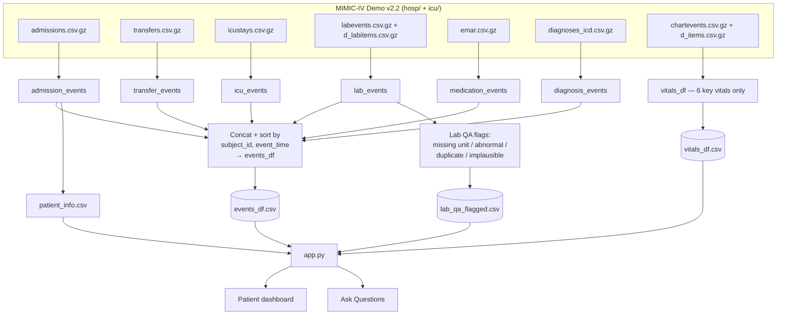

# Architecture

*Research and educational prototype. Not for clinical use.*

## The big picture



## Walking through the data flow

We start with six MIMIC-IV Demo v2.2 tables — five from `hosp/`, plus `icustays` and a filtered slice of `chartevents` from `icu/`. `chartevents` is huge, so it's read in chunks and immediately filtered down to six named vital-sign types to keep memory sane.

Every table gets its timestamps parsed with `errors="coerce"`, which just means a bad or malformed date becomes a blank rather than crashing the whole pipeline — it'll sort to the end of the timeline instead of blowing things up.

Each of the six sources gets reshaped into the same row format: patient ID, admission ID, stay ID, an event time, an event type, a human-readable description, and a pointer back to the exact source table and row. That's what makes it possible to concatenate labs, meds, admissions, and everything else into one list and sort the whole thing by time. That combined table — `events_df` — is the unified timeline the rest of the app reads from.

The lab data goes through one more step: a separate QA pass checks for four kinds of issues (see below) and saves the flagged version as `lab_qa_flagged.csv`. That file, not the lab rows sitting inside `events_df`, is what actually powers lab-value questions and the flagged-records view.

Everything gets saved as plain CSVs. `app.py` loads all four with `st.cache_data` so they're only read from disk once per running process, and renders both tabs directly from them. There's no database — the CSVs are the storage layer.

## How a question actually gets answered

```
Your question
     │
     ▼
The LLM maps it to a structured lookup — which metric or event type,
which aggregation — picking only from options that actually exist in
the data. It can't invent a lab name that isn't real.
     │
     ▼
Depending on what it picked:
   lab value question   → deterministic max/min/latest lookup, plain pandas
   event question        → deterministic filter of the timeline, plain pandas
   neither fits           → stop here, "cannot answer"
     │
     ▼
If nothing came back: stop, tell you why, no further LLM call.
If something came back: hand the LLM just that evidence and ask it
to explain it in a sentence — explicitly told not to add anything
that isn't in the evidence, and to cite where it came from.
     │
     ▼
You see the answer, plus a way to expand and see exactly what
evidence it was built from.
```

## Why we split it this way

The LLM only ever does two things here: figure out what you're asking, and explain what was found. It never does the actual lookup or the math — that's ordinary pandas code, which is faster, cheaper, deterministic, and testable in a way an LLM answer never quite is. This is the whole point of building it this way: the patient data is the source of truth, and the model sits on top of it as a translator, not a generator.

## The retrieval functions, specifically

`retrieve_lab_metric(subject_id, metric, agg)` filters the QA'd lab data down to one patient and one exact metric, keeps only numeric values, and returns the max, min, or most recent row depending on what was asked. `retrieve_event(subject_id, event_type)` does the equivalent for the timeline — filter to one patient, one event type, sorted by time. Both return the same shape of result (a status, some evidence, and a reason if nothing was found), so the UI and the answer-writing step can treat every kind of question the same way.

## When it says "I don't know"

This isn't the model deciding to be cautious — it's a set of hard rules that fire before the model ever gets a second chance to speak:

- The metric or event type you asked about doesn't exist in the data.
- There are no numeric records for that lab metric for this patient.
- Every matching lab record is flagged as implausible.
- There are no matching events for that event type for this patient.
- The question just doesn't map to anything the app knows how to look up.

In all of these cases you get "cannot answer" with a specific reason, and where there's disqualified evidence (like the all-implausible case), we still show it — the system doesn't hide the record, it just won't build an answer on top of something it flagged as unreliable.

## Lab quality flags

| Flag | What triggers it |
|---|---|
| missing_unit | There's a value but no unit attached to it |
| lab_marked_abnormal | The source system itself flagged this as abnormal |
| duplicate_result | The same patient, test, time, and value shows up more than once |
| implausible_value | The number falls outside a hand-picked plausible range for seven common tests |

These are additive tags on a copy of the data. Nothing gets changed or removed — a flagged row is still shown as-is, just marked for a human to double-check.

## Where it's deployed

Live at **https://aiforsmarterpatientcare.streamlit.app/**, on Streamlit Community Cloud — matches the code, which already checks `st.secrets` first for the API key. It's a single Streamlit process reading local CSVs and calling Groq per question; nothing more elaborate than that.

Confirmed working end to end on the live deployment: the dashboard renders, patient switching works, a real question returns a correct grounded answer with source citation, and a rate-limited Groq call returns the new graceful message instead of crashing. One known issue on the live deployment: the "Record types for this patient" table's Count column currently renders blank — see the Known Issues section of `docs/SUBMISSION_CHECKLIST.md` for the cause and the fix.

## What happens when things go wrong

| Situation | What happens |
|---|---|
| No API key set | The dashboard works fine; the question box shows a clear warning instead of the input |
| Groq rate limit (429) | Retried with backoff a couple of times, then a friendly error instead of a crash |
| Groq times out or the network drops | Same — retry, then a friendly error |
| The model's response comes back malformed | Caught by a general fallback, friendly error, no raw traceback |
| No numeric lab records / no matching events | Not a failure — this is the abstention logic working as intended |
| The four CSVs aren't present | Not currently handled gracefully — this will throw a plain `FileNotFoundError` and Streamlit will show its default error page. Known gap, not fixed yet. |
| Someone reruns the app while a question is already typed | Used to risk re-firing the same two LLM calls needlessly. Now the answer is cached per patient+question for the session, so that doesn't happen. |

## What we deliberately left alone

The six-table unification, the deterministic-retrieval-before-LLM design, and the abstention rules are all exactly as originally built. The only changes made during this review were reliability wrapping around the two Groq calls — retries, graceful failure, and a session-level cache — nothing about the prompts, the model, the math, or the UI changed.
